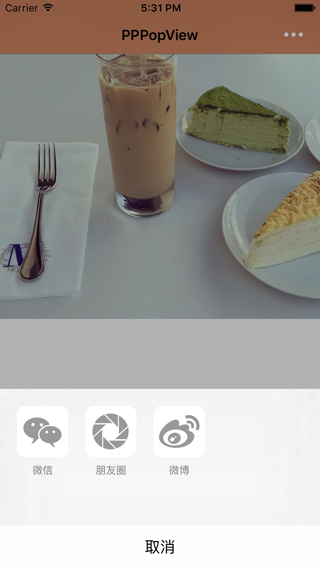

# PPPopView
分享功能弹曾实现－Swift
 

## Features




## Usage

```swift


let titles = [["title": "微信", "icon": "weixin"], ["title": "朋友圈", "icon": "friend-quan"], ["title": "微博", "icon": "weibo"]]
view.window?.showPopView(titles, closure: { (closure: Int) -> Void in

})
```

# License

PPButton is available under the MIT license. See the LICENSE file for more info.
